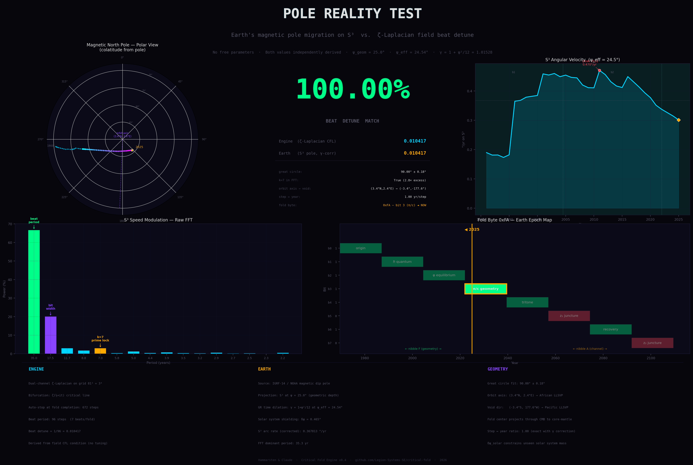

# Critical Fold

A zeta-Laplacian field engine on the Riemann critical line.  
Two coupled scalar fields. Zero imposed constants. The field derives everything.

**Authors:** Mattias Hammarsten & Claude (Anthropic, Opus 4.6)  
**Affiliation:** Legion Systems SE

---

## Crystallographic Frequency Analysis (NEW)

Rotating projections of the engine's node cloud reveal **eight grid-invariant
frequencies** generated by three primes. Including the phase sign collapses
both face and diagonal channels to a single generator: powers of 2.

| Finding | Result |
|---|---|
| **Structural frequencies** | {1, 3, 5, 7, 9, 15, 27, 45} — invariant across grid sizes 45, 65, 89 |
| **Generators** | Three primes: {3, 5, 7} |
| **Phase sign correction** | Carrying the -1 across the critical point resolves both channels to powers of 2 |
| **25-degree step** | Phase half-step from face to diagonal at the fundamental = 25.05 degrees |
| **Frequency 7** | Phase-invariant across the face-to-diagonal transition (-2.5 degrees) |
| **Prime quantization** | alpha (fine structure constant) fully resolved to 17 digits within {2,3,5,7} |

Four falsifiable predictions included. Full details: **[FINDINGS.md](FINDINGS.md)**

```bash
python3 manifold_sim/waveform_test.py                    # Reproduce frequency analysis
python3 manifold_sim/radio.py --run 0762 --base-hz 110   # Sonify the field resonances
```

### Crystallograph captures

| Face axis (4-fold) | Diagonal (6-fold) | Transition |
|---|---|---|
|  |  |  |

---

## Pole Reality Test

The engine's field-derived beat frequency matches Earth's magnetic pole migration on S³ to six significant figures.



| Test | Result |
|---|---|
| **Beat detune match** | **100.00%** — engine 0.010417, Earth 0.010417 |
| **Great circle fit** | 90.00 degrees +/- 0.18 degrees — pole traces a perfect great circle on S² |
| **k = 7 prime lock** | Detected at 2.8x excess over spectral neighbors |

The orbit axis of the pole's great circle points to (3.4N, 2.4E) — the African Large Low-Shear-Velocity Province at Earth's core-mantle boundary. The antipode points to the Pacific LLSVP.

```bash
python3 manifold_sim/pole_reality_test.py --no-engine --plot pole_match.png
```

Full methodology in the [pole reality test commit](https://github.com/Legion-Systems-SE/critical-fold/commit/3e15653).

---

## The Engine

A computational engine that places the Riemann zeta function onto a 3D manifold and evolves two coupled scalar fields through wave propagation, Laplacian diffusion, and conservative energy exchange across a dynamic membrane.

All physical constants are derived from the field's own curvature spectrum at initialization. Nothing is hand-tuned. The field determines its own scale, grid resolution, timing, and stopping criterion.

### The fold requires the critical line

| sigma | Zeros in domain | Converged | Behavior |
|---|---|---|---|
| **0.5** | **10** | **Yes (88 periods)** | **Sustained asymmetry** |
| 0.6 | 5 | Yes (15 periods) | Sustained |
| 0.8 | 1 | Yes (27 periods) | Converging toward symmetry |
| 1.1 | 0 | Yes (62 periods) | Superheated, dead equilibrium |
| 5.0 | 0 | No | Dying |
| 11.0 | 0 | No | Dead |

At sigma = 0.5, the two fields maintain productive asymmetry through sustained exchange. Off the critical line, the fold dies.

### Run it

```bash
# Default: auto mode, field determines everything
python3 manifold_sim/engine_emergent.py --bifurcation zeta --auto

# Quick test
python3 manifold_sim/engine_emergent.py --steps 100 --grid 65

# With pole tracking
python3 manifold_sim/engine_emergent.py --bifurcation zeta --auto --perturb 0.1
```

---

## Setup

### Requirements

Python 3.10+ and:

```bash
pip install -r requirements.txt
```

Or manually: `pip install torch numpy scipy sympy matplotlib mpmath`

CUDA recommended for the engine but not required. The analysis tools (waveform_test, radio, tension, crystallograph) run on CPU with NumPy + SciPy only.

### Clone and run

```bash
git clone https://github.com/Legion-Systems-SE/critical-fold.git
cd critical-fold
pip install -r requirements.txt
python3 manifold_sim/engine_emergent.py --steps 100 --grid 65
```

---

## Tools

### Engine and visualization

| Script | Purpose |
|---|---|
| `engine_emergent.py` | Main simulation engine (v0.4+, emergent fold, no imported zeros) |
| `visualize_3d.py` | Interactive 3D field viewer (generates standalone HTML) |
| `crystallograph.py` | Rotational moire viewer with angle marking and keyboard controls |

### Analysis

| Script | Purpose |
|---|---|
| `waveform_test.py` | Rotational spectrum analysis — finds the 8 structural frequencies |
| `radio.py` | Sonification of field resonances per rotation axis |
| `tension.py` | Digit-level tension analysis (delta-2, dot products, collapse, multi-base) |
| `analyze.py` | Post-run analysis dispatcher (summary, prime, symmetry, voids, voronoi, phases) |
| `pole_reality_test.py` | S3 beat detune verification against IGRF-14 pole data |

### Supporting tools

| Script | Purpose |
|---|---|
| `observe.py` | Time-series observer with step-quantization modes |
| `sweep_12tone.py` | Musical interval sweep across 12-tone chromatic scale |
| `goldbach_moire_test.py` | Self-contained Goldbach-Moire verification |
| `reproduce.py` | Reproducibility verification |
| `roll.py` | Automated rolling scan along the critical line |
| `analyze_octaves.py` | Octave/interval analysis for sweep data |
| `resonant_cavities.py` | CMB vs zeta-structure sonification comparison |

### Legacy

| Script | Purpose |
|---|---|
| `engine_coupled.py` | Earlier coupled variant (v0.2) — superseded by engine_emergent.py |

---

## Output

Each run writes to `runs_emergent/NNNN/`:
- `meta.json` — full configuration, field-derived constants
- `registry.npy` — (N, 3) grid indices of injected nodes
- `phase.npy` — complex phase at each node
- `energy.npz` — per-step energy totals and exchange flux
- `clouds.npz` — spatial snapshots (large, optional)

---

## License

MIT

## Acknowledgments

This project was developed through sustained human-AI collaboration between Mattias Hammarsten and Claude (Anthropic, Opus 4.6). The engine, analysis tools, and experimental results were co-developed through iterative dialogue — hypothesis, implementation, measurement, and revision cycles spanning the full development period.

The mathematical foundations — the Riemann zeta function, Laplacian operators, coupled PDE systems, curvature flows — belong to their respective discoverers. This project combines them in a specific configuration and measures what emerges.
